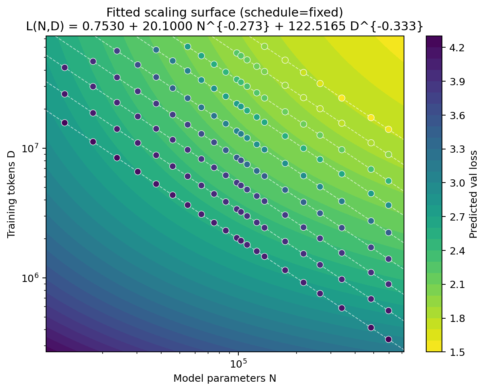
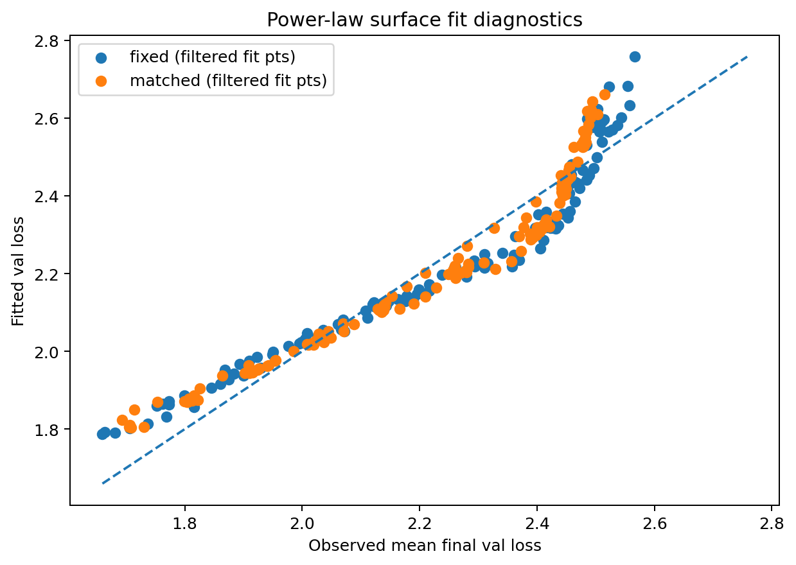
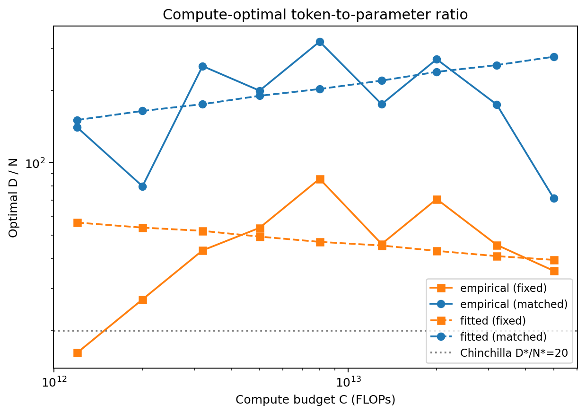

# Compute-Optimal Tiny Transformers

Replicating the Chinchilla scaling laws at the small scale: sweep over tiny GPT-like models (12K-600K parameters) on WikiText-103 to find the compute-optimal model size and training token count for each FLOP budget, then fit power-law scaling curves.

<table align="center"><tr>
  <td></td>
  <td></td>
  <td></td>
</tr></table>

## Key Findings

- **Scaling laws persist at small scale.** A controlled sweep over 21 GPT-style models (12K-600K non-embedding parameters) across 9 compute budgets (1.2×10¹²-5×10¹³ FLOPs) confirms that the qualitative structure of Chinchilla scaling laws holds deep into the tiny-model regime. Iso-compute sweeps at higher budgets produce clear U-shaped loss curves with well-defined interior minima, providing direct empirical evidence of a model-size vs. data tradeoff.

- **Fitted exponents closely match Chinchilla.** Under the fixed LR schedule, fitting the Chinchilla parametric surface L(N,D) = E + A/N^α + B/D^β yields α ≈ 0.27 and β ≈ 0.33. The sum α+β = 0.606 deviates from Chinchilla's 0.62 by only 2.3%, indicating that the overall curvature of the scaling surface is essentially preserved. The derived compute-optimal scaling exponents (N* ∝ C^0.55, D* ∝ C^0.45) are within ~0.10 of the Chinchilla values.

- **Small models are more data-hungry: optimal D/N is 2-3× above Chinchilla.** Under the fixed schedule, the empirical compute-optimal token-to-parameter ratio ranges from 16 to 86 (mean ≈ 47), compared to Chinchilla's ~20 heuristic. The elevated ratios are consistent with byte-level tokenization carrying higher entropy per token, limited model capacity requiring more data to exploit, and the small WikiText-103 corpus. Notably, the ratio trends downward at the highest compute budgets (reaching 35.5 at 5×10¹³ FLOPs), suggesting convergence toward large-scale behavior as compute grows.

- **Learning-rate schedule regime is a first-order confound.** The matched schedule (where each run's cosine decay horizon equals its own training length) systematically favors small models that train for many steps, inflating the empirical D*/N* to a mean of 187 (vs. 47 under the fixed schedule) with extreme volatility (71-320). The matched-schedule fitted exponents (α ≈ 0.37, β ≈ 0.27) flip the relative importance of model size and data relative to the fixed-schedule result, demonstrating that apparent scaling behavior can change qualitatively based solely on optimization conditions rather than intrinsic model properties.

## Pipeline

1. **Data** - Download & prepare byte-level train/val/test splits from WikiText-103
2. **Sweep** - Generate an iso-compute grid of (model, tokens) pairs across 9 compute budgets
3. **Train** - Train every configuration across multiple seeds and two LR-schedule regimes (matched & fixed-horizon)
4. **Aggregate** - Collect per-run validation losses into a summary table
5. **Fit & Plot** - Fit a Chinchilla-style parametric loss surface and produce scaling-law plots

## Running the Experiment

Everything lives in a single Jupyter notebook:

```bash
pip install -r requirements.txt
jupyter notebook notebook.ipynb
```

Run all cells top-to-bottom. The notebook will download data, train the sweep, and save plots to `outputs/plots/`.